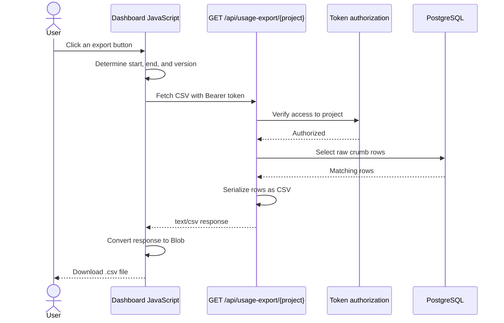

# Dashboard CSV Export

This document describes the CSV export currently implemented on the
`update-dashboard-with-csv-export` branch. It follows an export from the
dashboard button, through the API and database, and back to the browser as a
download.

> [!IMPORTANT]
> This is a description of the current working tree, not a claim that every
> part is production-ready. The [Review findings](#review-findings) section
> identifies behavior that should be resolved before merging.

## What the export is for

The charts display aggregated usage data:

```text
date + version + status → session count
```

That aggregate is useful for visualization, but it is not a faithful export of
the underlying telemetry. The new export therefore does **not** use
ApexCharts' built-in CSV output. Instead, the dashboard asks the server for the
raw `migas.crumbs` rows matching the selected project, time range, and optional
version.

The intended result is one CSV row per matching database crumb.

## End-to-end flow



The main pieces are:

| Layer | Location | Responsibility |
| --- | --- | --- |
| Dashboard controls | `migas/static/dashboard.html` | Presents the export buttons |
| Browser behavior | `migas/static/js/dashboard.js` | Chooses filters, calls the API, and starts the download |
| API endpoint | `migas/server/api/routes.py` | Authorizes, serializes, and returns the CSV |
| Database query | `migas/server/database.py` | Selects raw crumb rows |
| Database model | `migas/server/models.py` | Declares the `params` JSONB column |
| Migration | `alembic/versions/7a13ef1e90c4_add_crumb_params.py` | Adds `params` to existing databases |
| API tests | `migas/server/tests/test_usage_api.py` | Checks filtering and project authorization |

## Dashboard export modes

The current working tree presents three buttons.

### Export CSV

`Export CSV` calls `_exportVisibleRangeCsv()`.

It exports:

- The currently selected project.
- The chart's current visible start and end dates.
- Only the selected version when a version filter is active.
- All versions when the dashboard is set to **All Versions**.

The browser normalizes the bounds to complete UTC days:

```text
start → 00:00:00.000 UTC
end   → 23:59:59.999 UTC
```

If the chart does not currently have explicit viewport bounds, the function
uses the earliest and latest dates present in the project's browser-side day
cache.

### Export All

`Export All` calls `_exportAllDataCsv()`.

Despite its current label, it does **not** ask the database for the project's
true minimum and maximum timestamps. It derives its range from
`dataCache[project].day`.

This means “all” currently means:

> All dates that have already been loaded into this dashboard session.

On the initial dashboard load, that may only be the default four-week window.
The range grows if the user previously requested more history. An active
version filter is also applied to this export.

### Export Custom

`Export Custom` calls `_exportCustomRangeCsv()`.

- A start date is required.
- The start becomes midnight UTC.
- A supplied end date becomes `23:59:59 UTC`.
- If no end date is supplied, the current time is used.
- An active version filter is applied.

This function reads the same `custom-start` and `custom-end` inputs used by the
dashboard's custom time-range control.

## Browser request

All three modes ultimately make the same authenticated request:

```http
GET /api/usage-export/{project}?start={ISO-8601}&end={ISO-8601}&version={optional}
Authorization: Bearer {dashboard-token}
```

For example:

```http
GET /api/usage-export/nipreps/fmriprep
    ?start=2026-07-01T00:00:00.000Z
    &end=2026-07-07T23:59:59.999Z
    &version=25.1.0
```

Project path components are encoded individually so a project such as
`nipreps/fmriprep` keeps its slash while unsafe characters are escaped.

## API behavior

The endpoint is:

```python
@router.get('/usage-export/{project:path}')
async def export_usage_csv(...)
```

It performs these checks before querying:

1. `require_access()` verifies that the Bearer token may access the requested
   project.
2. Naive timestamps are treated as UTC.
3. A start later than the end returns HTTP 400.
4. A missing project returns HTTP 404.

The `start` and `end` query parameters are required. `version` is optional.

## Database query

`query_crumb_export()` selects raw `Crumb` records using:

```text
project = requested project
timestamp >= requested start
timestamp <= requested end
version = requested version, when supplied
```

Rows are ordered by:

1. `timestamp` ascending
2. `idx` ascending

The existing `(project, timestamp)` index supports the primary project and
time-range filter.

## Exported columns

The CSV header is currently explicit and stable:

| Column | Source |
| --- | --- |
| `idx` | `crumbs.idx` |
| `project` | `crumbs.project` |
| `version` | `crumbs.version` |
| `language` | `crumbs.language` |
| `language_version` | `crumbs.language_version` |
| `timestamp` | `crumbs.timestamp` |
| `session_id` | `crumbs.session_id` |
| `user_id` | `crumbs.user_id` |
| `status` | `crumbs.status` |
| `status_desc` | `crumbs.status_desc` |
| `error_type` | `crumbs.error_type` |
| `error_desc` | `crumbs.error_desc` |
| `is_ci` | `crumbs.is_ci` |
| `params` | `crumbs.params` |

These are all columns currently declared on `Crumb`. The export does not join
the related `users` or `geoloc` tables.

Because the list is explicit, adding another `crumbs` column in the future
will require updating both `query_crumb_export()` and
`CRUMB_EXPORT_COLUMNS`.

## JSON and JSONB handling

JSON objects and arrays are deliberately kept intact in one cell. They are not
flattened into dynamic columns.

Before the CSV writer receives a value:

- A `datetime` becomes an ISO-8601 string.
- A `dict` or `list` becomes JSON using `json.dumps(..., sort_keys=True)`.
- `None` becomes an empty cell.
- Other scalar values pass through unchanged.

Example database value:

```json
{
  "labels": ["control", "patient"],
  "output_spaces": {
    "MNI": true,
    "T1w": false
  }
}
```

Conceptual CSV output:

```csv
idx,project,params
42,nipreps/fmriprep,"{""labels"": [""control"", ""patient""], ""output_spaces"": {""MNI"": true, ""T1w"": false}}"
```

The commas inside JSON are safe. Python's `csv.DictWriter` quotes the complete
cell and doubles its internal quotation marks according to CSV rules. A CSV
parser reconstructs the cell as the original JSON string, which the downloader
can then parse.

Arrays receive the same treatment:

```json
["one", "two", "three"]
```

They remain one quoted CSV cell rather than becoming indexed columns.

## Response and filename

The server responds with:

```http
Content-Type: text/csv; charset=utf-8
Content-Disposition: attachment; filename="migas-{project}-{start-date}-{end-date}.csv"
```

Slashes and other unsafe filename characters in the project name are replaced
with hyphens.

The browser:

1. Reads the complete response as a `Blob`.
2. Creates a temporary object URL.
3. Creates and clicks an `<a download>` element.
4. Removes the element and revokes the object URL.

If the server supplies a filename in `Content-Disposition`, the browser uses
it. Otherwise, the JavaScript uses a fallback filename.

## Authorization and error behavior

The export uses the same project-scoped authorization dependency as the usage
endpoint.

- Missing or invalid token: HTTP 401.
- Valid token for another project: HTTP 403.
- Unknown project: HTTP 404.
- Start after end: HTTP 400.

The dashboard attempts to read the API's JSON error detail. If that is not
available, it falls back to the response text and displays an alert.

## Tests currently present

The API tests verify:

- Raw crumbs are returned rather than chart aggregates.
- The requested timestamp range is honored.
- The active version filter is honored.
- Expected scalar fields appear in the CSV.
- A null `params` value becomes an empty cell.
- A project-scoped token cannot export a different project.

Coverage that is not yet present includes:

- A populated JSON/JSONB `params` value containing commas, quotes, tabs, or
  newlines.
- An array stored in `params`.
- An export with no matching rows.
- Start-after-end validation.
- Unknown-project behavior.
- Master-token export.
- Browser tests for all three buttons.
- Large-result memory behavior.

## Review findings

The following items are important to resolve or explicitly accept before this
feature is considered complete.

### 1. The implementation buffers the export multiple times

The database function calls `res.all()`, so every matching row is loaded into
server memory. The route then builds the complete CSV in `StringIO`. Finally,
the browser calls `res.blob()`, which buffers the complete response again.

```text
PostgreSQL result → Python row list → Python CSV string → browser Blob
```

This is straightforward for small exports but unsafe for large result sets.
A production-scale version should stream rows from PostgreSQL and return a
`StreamingResponse`. Very large exports may be better handled as background
jobs written to object storage.

### 2. “Export All” is not a database-wide export

Its date bounds come from the browser cache, which normally contains a limited
window. Either:

- Rename it to **Export Loaded Data**; or
- Add a server-side mode that determines the complete project range; or
- Remove it and keep visible/custom range exports only.

### 3. The `params` column is not wired into ingestion

The ORM model and migration define `Crumb.params`, and the export includes it.
However, the current request models, GraphQL types, `insert_crumb()`, and
`ingest_project()` do not pass `params` into the database insert.

The breadcrumb tests submit a `params` field, but Pydantic currently ignores
that extra input. As a result, normal ingestion will leave the exported
`params` cell empty unless another process populates the column.

### 4. The reset-zoom control was removed from the HTML

The current uncommitted dashboard change replaces the `Reset View` button with
`Export All` and `Export Custom`. Other JavaScript still calls:

```javascript
document.getElementById("reset-zoom-btn").classList...
```

With the element absent, dashboard metric updates can raise a JavaScript error.
The reset button should be restored or all references should be made
null-safe.

### 5. All export modes manipulate the first button

`_exportAllDataCsv()` and `_exportCustomRangeCsv()` both obtain:

```javascript
document.getElementById("export-csv-btn")
```

Therefore, clicking **Export All** or **Export Custom** disables and relabels
the separate **Export CSV** button instead of the button the user clicked.

The functions should receive the clicked button, select their own IDs, or use
one shared export function with a button argument.

### 6. The browser code is duplicated

Each export mode independently implements authentication, error parsing, Blob
creation, filename selection, and cleanup. A shared helper could reduce this
to:

```javascript
_downloadUsageCsv({ start, end, version, button, fallbackFilename })
```

The three public functions would then only determine their date bounds.

### 7. The column contract is narrower than “all related telemetry”

The export contains every currently declared `crumbs` field, but not the
associated user or geolocation fields. If “all fields for an entry” means the
complete normalized telemetry record, the query would need left joins to
`users` and `geoloc`.

### 8. Spreadsheet formula handling is undefined

Fields such as status and error descriptions may contain user-controlled text.
CSV applications can interpret cells beginning with `=`, `+`, `-`, or `@` as
formulas. Preserving raw data and making spreadsheet opening safe are
different goals; the intended policy should be decided explicitly.

## Decisions to review

1. Should **Export All** mean all database history or all currently loaded
   dashboard data?
2. Should exports contain only `crumbs` columns, or also joined user and
   geolocation fields?
3. What is the largest export the synchronous endpoint should permit?
4. Should the server stream CSV immediately, or create asynchronous export
   jobs for large ranges?
5. Should the original `params` JSON be the only representation, or should
   selected keys optionally receive dedicated columns later?
6. Should formula-like strings be preserved exactly or escaped for spreadsheet
   safety?
7. Should `params` be accepted by both REST and GraphQL ingestion, or only one
   interface?

